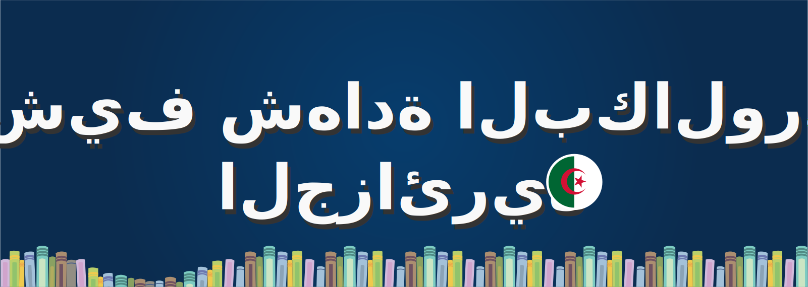

  

# Algerian Baccalaureate Exam Archive | أرشيف شهادة البكالوريا الجزائرية

An open-source archive of Algerian Baccalaureate (BAC) exam papers and their corrections, collected for educational and archival purposes.

---

### 📖 About This Project

<strong>English</strong>

The goal of this project is to provide a clean, well-organized, and permanent collection of past BAC exam papers for all subjects and streams. This makes it easier for Algerian students to prepare for their exams and for educators to find resources.

All files are sourced from all sites across the internet. This repository is an unofficial mirror created to ensure the longevity and accessibility of these valuable materials.

<strong>العربية</strong>

الهدف من هذا المشروع هو توفير مجموعة منظمة ودائمة لمواضيع وحلول شهادة البكالوريا الجزائرية لجميع المواد والشعب. يهدف هذا الأرشيف إلى تسهيل تحضير الطلاب للامتحانات وتوفير مصدر موثوق للأساتذة والمجتمع التعليمي.

جميع الملفات مأخوذة من مختلف المواقع على الانترنت. هذا المستودع هو مرآة غير رسمية تم إنشاؤها لضمان استمرارية الوصول إلى هذه الموارد القيمة.

### 🗂️ Folder & Naming Structure | هيكل المجلدات والملفات

The repository is organized to be as clear and user-friendly as possible. The structure is:

`Subject / Stream / YEAR-SUBJECT-STREAM-TYPE.pdf`

-   **Subject:** The academic subject (e.g., `history-geography`, `arabic-literature`).
-   **Stream:** The student's specialty (e.g., `scientific-stream`, `literature-and-philosophy`).
-   **Filename:** Contains all information (Year, Subject, Stream, and Type) to make every file unique and self-describing, preventing download overwrites. For example: `2023-arabic-literature-scientific-stream-exam.pdf`.

### ✅ Available Subjects (To-Do List) | قائمة المواد (مهام مستقبلية)

This is the planned list of subjects for the archive. Contributions to complete this list are highly welcome!

#### Core Subjects | المواد الأساسية
-   [x] History & Geography (`history-geography`)
-   [ ] Mathematics (`mathematics`)
-   [ ] Physics (`physics`)
-   [ ] Natural Sciences (`natural-sciences`)
-   [ ] Philosophy (`philosophy`)
-   [ ] Islamic Sciences (`islamic-sciences`)

#### Languages | اللغات
-   [x] Arabic Literature (`arabic-literature`)
-   [ ] French Language (`french-language`)
-   [ ] English Language (`english-language`)
-   [ ] Amazigh Language (`amazigh-language`)
-   [ ] Spanish Language (`spanish-language`)
-   [ ] German Language (`german-language`)
-   [ ] Italian Language (`italian-language`)

#### Economics & Management Stream | شعبة تسيير واقتصاد
-   [ ] Accounting & Financial Management (`accounting-financial-management`)
-   [ ] Economics & Management (`economics-management`)
-   [ ] Law (`law`)

#### Technical Stream (Math-Technique) | شعبة تقني رياضي
-   [ ] Civil Engineering (`civil-engineering`)
-   [ ] Electrical Engineering (`electrical-engineering`)
-   [ ] Mechanical Engineering (`mechanical-engineering`)
-   [ ] Methods Engineering (`methods-engineering`)

### 🙌 How to Contribute | كيفية المساهمة

Contributions are the best way to make this archive complete! If you have missing files, want to add a new subject, or notice an error, please follow these steps:

1.  **Check the To-Do List:** See what subjects are still needed.
2.  **Organize Your Files:** Ensure your files are organized according to the `Subject / Stream` folder structure.
3.  **Name Your Files Correctly:** Use the `YEAR-SUBJECT-STREAM-TYPE.pdf` naming scheme.
4.  **Open an Issue or Pull Request:**
    *   For a few files, you can open an "Issue" and attach them.
    *   For a large number of files (like a whole new subject), a "Pull Request" is preferred.

Thank you for helping to build this valuable resource for all Algerian students.

### ✍️ Author | صاحب المشروع

This project is curated and maintained by **AZHAR ZOUHIR / BYTEDz**.

### 📜 License | الترخيص

This project is licensed under the **MIT License**. See the `LICENSE` file for details. You are free to use, share, and modify the contents of this repository for any purpose.